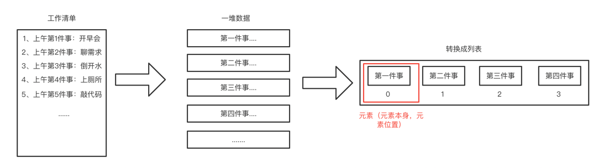

# ListClass 类
> 简介

列表是在生活中特别常见都一种数据展示的方式，比如：购物车列表、班级排名、
公司人员清单。等等...列表展示数据比较清晰，对于列表的数据处理也比较方便
我们可以抽象出一个列表的数据类型定义。

列表是一组有序的数据，每一个列表中的数据项叫做元素，在很多强类型中列表中
的数据都是有数据类型统一的，在弱类型语言里比如 JavaScript 中就不存在数据类型的区别，
任意数据都可以放置进去。

由于列表是一个有序的元素集合，那么每个元素就会有个对应的位置信息，可以叫做下标，或者叫做索引。都是指当前元素在列表中的位置。

> 工作清单转换成一堆数据以及最后在列表中的展现方式



#### 1、列表的抽象数据类型定义

| 属性/方法          | 描述               |
|----------------|------------------|
| listSize(属性)   | 列表中多少个元素         |
| pos(属性)        | 列表当前位置           |
| length(方法)     | 获取列表元素数量         |
| clear(方法)      | 清空列表所有元素         |
| toString(方法)   | 返回列表中元素以字符串的方式返回 |
| getElement(方法) | 返回当前位置元素         |
| inset(方法)      | 插入一个元素在指定元素后面    |
| append(方法)     | 在列表的尾部增加一个元素     |
| remove(方法)     | 删除指定元素           |
| front(方法)      | 修改当前位置到列表第一位     |
| end(方法)        | 修改当前位置到列表最后一位    |
| prev(方法)       | 将当前位置前移一位        |
| next(方法)       | 将当前位置后移一位        |
| hasNext(方法)    | 是否还有下一个元素        |
| hasPrev(方法)    | 是否还有前一个元素        |
| currPos(方法)    | 返回当前位置           |
| moveTo(方法)     | 将当前位置移动到指定位置     |
| findIndex(方法)  | 返回指定元素在列表中到位置    |
| find(方法)       | 查找是否存在指定元素       |

#### 2、搭建开发环境

> 2.1、语言

使用 JavaScript 来编写列表类，虽然说已经内置了一个 Array，我们可以原生实现一个。

> 2.2、创建文件

使用html文件通过浏览器解析来展示我们编写到 ListClass 类
```html
<!DOCTYPE html>
<html lang="en">
<head>
  <meta charset="UTF-8">
  <title>学习数据结构与算法之列表类</title>
  <script src="./JavaScript/ListClass.js"></script>
</head>
<body>

</body>
<script>
</script>
</html>
```

创建一个 JavaScript 到文件夹，存放编写到 xx.js 文件，并且创建 ListClass.js 文件

在 ListClass.js 中创建 ListClass 并做好初始化结构。
```js
class ListClass {
  constructor() {
    // 当前存储容器
    this.list = [];
    // 列表元素的个数
    this.listSize = 0;
    // 列表的当前位置
    this.pos = 0;
  }

  // length 方法返回当前元素的个数
  length = () => {};

  // clear 清空整个列表
  clear = () => {};

  // toString 返回列表的字符串形式
  toString = () => {};

  // getElement 返回当前位置的元素
  getElement = () => {};

  // inset 在现有的元素位置后插入新元素
  inset = (element, after) => {};

  // findIndex 查询指定元素到下标
  findIndex = (element) => {};

  // find 在列表中查找指定元素
  find = (element) => {};

  // append 在列表末尾添加新元素
  append = (element) => {};

  // remove 删除指定元素
  remove = (element) => {};

  // front 将列表当前位置移动到第一个元素
  front = () => {};

  // end 将列表当前位置移动到最后个元素
  end = () => {};

  // prev 将当前位置前移一位
  prev = () => {};

  // next 将当前位置后移一位
  next = () => {};

  // hasNext 判断是否还有后一位
  hasNext = () => {};

  // hasPrev 判断是否还有前一位
  hasPrev = () => {};

  // currPos 返回当前位置
  currPos = () => {};

  // moveTo 将当前位置移动到指定位置
  moveTo = (index) => {};
}
```
#### 3、对应实现所有方法

> 3.1、 length 方法的实现

length 方法主要返回当前列表中的元素个数，我们在初始化类中定义了一个属性 listSize
可以直接返回这个属性；

参数：无

返回值：当前列表元素个数
【实现】
```js
length = () => this.listSize;
```
> 3.2、 clear 方法的实现

clear 方法是清空整个列表的方法，只要调用就会把列表置为初始状态，或者说是删除所有数据。

参数：无

返回值：无

【实现】
```js
clear = () => {
  // 清空列表
  this.list.length = 0;
  // 将列表数量重置
  this.listSize = 0;
}
```

> 3.3、toString 方法的实现

toString 方法是将当前列表中所有元素都转成字符串用逗号拼接都方式返回。

参数：无

返回值：拼接好的字符串

【实现】
```js
toString = () => {
  // 定义返回值
  let res = '';
  // 循环获取容器内的数据
  for (let i = 0; i < this.listSize; i++) {
    // 拼接元素
    res += this.list[i];
    // 判断最后一个元素不拼接逗号，其他都拼接一个逗号用来隔开每个元素
    res += i === this.listSize - 1 ? '' : ','
  }
  return res;
}
```

> 3.4、getElement 方法的实现

getElement 方法是获取当位置在列表中的元素，我们在类中定义了 pos 属性来记录当前位置

参数：无

返回值：列表当前位置

【实现】
```js
getElement = () => this.list[this.pos];
```

> 3.5、inset 方法的实现

inset 方法是将一个元素插入到指定元素到后面，目前实现的规则是：
+ 1、找到了指定元素就插入到指定元素到后面
+ 2、没有找到指定元素，就在列表到尾部新增一个
+ 3、任意以上到操作都需要更新一下当前 listSize 都数量

参数：
+ 需要插入的元素 element
+ 需要插入在那个元素后 after

返回值：
+ 插入成功：true
+ 插入失败：false

【实现】
```js
inset = (element, after) => {
  // 查找到需要插入到位置
  let index = this.findIndex(after);
  // 判断是否找到了
  if (index === -1) {
    return false;
  }
  // 将 index 位置往后到都单独存一份
  const list = [];
  for (let i = ++index; i < this.listSize; i++) {
    list.push(this.list[i]);
  }
  // 插入元素
  this.list[index++] = element;
  // 增加列表数量
  this.listSize++;
  // 恢复之前都数据
  for (; index < this.listSize; index++) {
    this.list[index] = list.shift()
  }
  return true;
}
```

> 3.6、 findIndex 方法的实现

findIndex 方法是查找指定元素在列表中的位置，如果找不到就返回 -1

参数：需要查找到元素 element

返回值：
+ 找到元素：对应下标
+ 没有元素：-1

【实现】
```js
findIndex = (element) => {
  for (let i = 0; i < this.listSize; i++) {
    if (this.list[i] === element) {
      return i;
    }
  }
  return -1;
}
```

> 3.7、 find 方法的实现

find 方式是用于查找指定元素是否在列表中

参数： 无

返回值：
+ 存在：true
+ 不存在：false

【实现】
```js
find = (element) => {
  for (let i = 0; i < this.listSize; i++) {
    if (this.list[i] === element) {
      return true;
    }
  }
  return false;
}
```

> 3.8、 append 方法的实现

append 方法是在列表的尾部添加元素，然后更新 listSize 的长度

参数：需要添加的元素 element

返回值：无

【实现】
```js
append = (element) => this.list[this.listSize++] = element;
```

> 3.9、 remove 方法的实现

remove 方法是在列表中删除指定元素，删除第一个出现的元素，如果出现重复元素的时候，
优先匹配第一个出现的元素，并且删除。

参数：需要删除的元素 element

返回值：
+ 删除成功：true
+ 删除失败：false

【实现】
```js
remove = (element) => {
  // 查找到需要删除到位置
  let index = this.findIndex(element);
  // 判断是否找到了
  if (index === -1) {
    return false;
  }
  // 减少列表数量
  this.listSize--;

  // 将 index 位置往后都前移一位
  for (let i = index; i < this.listSize; i++) {
    this.list[i] = this.list[i + 1]
  }

  return true;
}
```

> 3.10、 front 方法的实现

front 方法是将当前列表位置调整到第一位

参数：无

返回值：无

【实现】
```js
front = () => this.pos = 0;
```

> 3.11、 end 方法的实现

end 方法是将当前列表位置调整到列表最后一位

参数：无

返回值：无

【实现】
```js
end = () => this.pos = this.listSize - 1;
```

> 3.12、 prev 方法的实现

prev 方法是将当前列表位置向前调整一位，但是不能成负数

参数：无

返回值：无

【实现】
```js
prev = () => {
  if (this.pos > 0) {
    this.pos--;
  }
}
```

> 3.13、 next 方法的实现

next 方法是将当前列表位置向后调整一位，但是不能超过列表总长度

参数：无

返回值：无

【实现】
```js
next = () => {
  if (this.pos < this.listSize) {
    this.pos++;
  }
}
```

> 3.14、 hasNext 方法的实现

hasNext 方法判断当前位置往后一位是否还有元素

参数：无

返回值：
+ 还有元素：true
+ 没有元素：false

【实现】
```js
hasNext = () => this.pos < this.listSize;
```

> 3.15、 hasPrev 方法的实现

hasPrev 方法判断当前位置往前一位是否还有元素

参数：无

返回值：
+ 还有元素：true
+ 没有元素：false

【实现】
```js
hasPrev = () => this.pos > 0;
```

> 3.16、 currPos 方法的实现

currPos 方法返回当前列表位置

参数：无

返回值：当前列表位置

【实现】
```js
currPos = () => this.pos;
```

> 3.17、 moveTo 方法的实现

moveTo 方法是将列表当前位置移动到指定位置

参数：无

返回值：当前列表位置

【实现】
```js
moveTo = (index) => this.pos = index;
```
#### 4、简单使用

> 4.1、添加工作清单内容

使用我们在 ListClass 类中定义的 append 方法添加每一个需要完成的工作项，
最后使用 toString 方法将所有工作项一一用逗号拼接起来
```js
const list = new ListClass();
list.append('1、第一件事...');
list.append('2、第二件事...');
list.append('3、第三件事...');
list.append('4、第四件事...');
list.append('5、第五件事...');
console.log(list.toString());
// 1、第一件事...,2、第二件事...,3、第三件事...,4、第四件事...,5、第五件事...
```
> 4.2、插入工作清单内容

如果有着急的事情需要插队的时候，就可以使用我们的 inset 方法
```js
list.inset('2.1、我是插队的任务...', '2、第二件事...');
console.log(list.toString());
// 1、第一件事...,2、第二件事...,2.1、我是插队的任务...,3、第三件事...,4、第四件事...,5、第五件事...
```
> 4.3、删除工作清单内容

当工作项完成当时候就可以把工作清单中当数据给删除啦。
```js
list.remove('1、第一件事...');
list.remove('2、第二件事...');
list.remove('2.1、我是插队的任务...');
console.log(list.toString());
// 3、第三件事...,4、第四件事...,5、第五件事...
```

#### 5、进阶使用

列表本质上是一个容器，一个有序存储元素项当一个容器，也叫做一种数据结构，
通常数据结构都会搭配一些算法来处理数据，或者完成一些特定场景的需求。

> 需求1：实现一个1-5的阶乘

关于实现这个1-5的阶乘有非常多办法，比如常见的递归：
```js
const factorial = n1 => {
  if( n1 === 1 ){
    return n1;
  }
  return n1 * factorial(--n1)
}
console.log(factorial(5));// 120
```
我们还可以使用刚刚写列表来实现：
```js
const factorial = n1 => {
  const list = new ListClass();
  let res = n1;
  while (--n1 ){
    list.append(n1);
  }
  while (list.hasNext()){
    res *= list.getElement();
    list.next();
  }
  return res;
}
console.log(factorial(5));// 120
```
上面这个方法有点类似将列表当成栈的结构在处理，栈的结构与列表类似，不过是两种不同的数据结构，
实现的方式和应用的场景很多的不同。

以上就是关于列表数据结构的分享，欢迎各位朋友多多指导。


