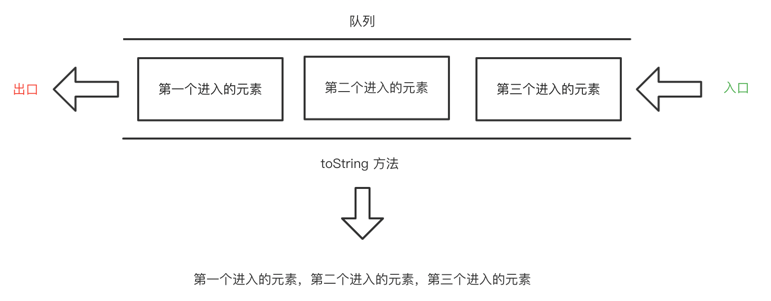

# QueueClass 类

> 简介

队列也是一种列表，也是用列表作为容器来存储队列里的数据，和列表不同的是，队列的数据操作，
添加数据只能在尾部添加，删除数据只能删除头部的第一个元素，这个和上一次分享的栈结构有点像，
不过栈是 先进后出(first in last out), 队列是 先进先出(first in first out);

生活中有非常多这样的例子，比如排队买早饭，先排队的肯定先买。排队做核酸，排在前面的肯定先做。

在语言中也非常的常见，比如任务队列，事件队列，等等，宏任务微任务，都是队列方式存储以及后续的调用处理的。

> 图解


#### 1、队列的抽象数据类型定义

| 属性/方法         | 描述            |
|---------------|---------------|
| dataStore(属性) | 存储队列数据的容器     |
| enqueue(方法)   | 在队列尾部添加元素     |
| dequeue(方法)   | 在队列头部删除元素     |
| front(方法)     | 获取队列头部元素      |
| back(方法)      | 获取队列尾部元素      |
| toString(方法)  | 将队列中元素用逗号拼接返回 |
| empty(方法)     | 判断队列是否为空      |

#### 2、搭建开发环境

> 2.1、语言

使用 JavaScript 来编写队列的数据结构以及实现对应的方法

> 2.2、创建文件

使用html文件通过浏览器解析来展示我们编写到 QueueClass 类
```html
<!DOCTYPE html>
<html lang="en">
<head>
  <meta charset="UTF-8">
  <title>学习数据结构与算法之队列</title>
  <script src="./JavaScript/QueueClass.js"></script>
</head>
<body>

</body>
<script>
</script>
</html>
```

创建一个 JavaScript 到文件夹，存放编写到 xx.js 文件，并且创建 QueueClass.js 文件

在 QueueClass.js 中创建 QueueClass 并做好初始化结构。

```js
class QueueClass{
  constructor(){
    // 初始化一个容器
    this.dataStore = [];
  }
  // 尾部添加元素的方法
  enqueue = (element) => {};

  // 头部删除元素的方法
  dequeue = () => {};

  // 获取头部元素
  front = () => {};

  // 获取尾部元素
  back = () => {};

  // 逗号拼接队列中的元素
  toString = () => {};

  // 验证队列是否为空
  empty = () => {};
}
```
#### 3、对应实现所有方法

##### 3.1、 enqueue 方法

> 思路

我们使用来数组作为队列的容器，因为添加方法只能在尾部添加，那么我们可以用两种添加的方式，
1、使用数组长度来添加；2、使用数组本身提供的push方法。

> 图解


> 实现

参数：需要添加的元素

返回值：无
```js
// 尾部添加元素的方法---实现1
enqueue = (element) => {
  this.dataStore.push(element);
};

// 尾部添加元素的方法---实现2
enqueue = (element) => {
  this.dataStore[this.dataStore.length] = element;
};
```

##### 3.2、 dequeue 方法

> 思路

我们使用来数组作为队列的容器，可以直接使用数组的 shift 方法删除头部元素

> 图解


参数：无

返回值：无

```js
// 头部删除元素的方法
dequeue = () => {
  this.dataStore.shift();
};
```
##### 3.3、 front 方法

> 思路

我们使用来数组作为队列的容器，可以直接返回数组的第0个元素

> 图解


参数：无

返回值：队列中的头部元素

```js
// 获取头部元素
front = () => this.dataStore[0];
```
##### 3.4、 back 方法

> 思路

我们使用来数组作为队列的容器，可以直接返回数组的第最后一个元素

> 图解


参数：无

返回值：队列中的尾部元素

```js
// 获取尾部元素
back = () => this.dataStore[this.dataStore.length - 1];
```

##### 3.5、 toString 方法

> 思路

我们使用来数组作为队列的容器，可以直接遍历数据将数据拼接返回

> 图解



参数：无

返回值：队列中的元素用逗号拼接

```js
// 逗号拼接队列中的元素
toString = () => {
  // 定义返回值
  let res = '';
  // 循环获取容器内的数据
  for (let i = 0; i < this.dataStore; i++) {
    res += this.dataStore[i];
    res += i === this.top - 1 ? '' : ','
  }
  return res;
};
```
##### 3.6、 empty 方法

> 思路

我们使用来数组作为队列的容器，可以直接判断当前长度是否为0

参数：无

返回值：true | false

```js
// 验证队列是否为空
empty = () => this.dataStore.length === 0;
```
#### 4、队列的基本使用
```js
// 实例化
const queue = new QueueClass();

// 添加数据
queue.enqueue(1);
queue.enqueue(2);
queue.enqueue(3);
queue.enqueue(4);
queue.enqueue(5);

console.log(queue.toString());// 1,2,3,4,5

// 删除数据
queue.dequeue();
queue.dequeue();
queue.dequeue();

console.log(queue.toString());// 4,5
console.log(queue.empty());// false

queue.dequeue();
queue.dequeue();
console.log(queue.empty());// true

queue.enqueue(3);
queue.enqueue(4);
queue.enqueue(5);

console.log(queue.front());// 3
console.log(queue.back());// 5
```


