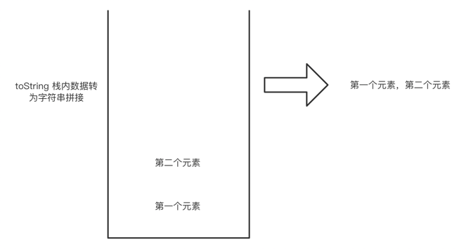

# StackClass 类

> 简介

栈是和列表非常相似的数据结构，不过对于数据的处理只能是从一头进从一头出，
会造成一个什么现象呢？先进的数据只能后出来，后进去的数据可以先出来。也就是相当于把列表的一端给堵住了，
只能从另一端对数据进行处理

举个例子：栈结构就和我们枪械对弹夹一样，子弹从一端进入弹夹内，但是真正在开枪射击的时候，
不会先打出去第一颗进入弹夹的子弹，而是最后进入弹夹的那一颗子弹。

栈结构拥有这样的一个特性，所以可以做到非常多事情，在不同语言中对表达式和函数对调用都能看到栈对身影。
栈被称为后入先出(LIFO, last-in-first-out)对数据结构。

根据上面对介绍，我们可以得知栈的数据操作非常简单，添加数据（入栈/压栈），删除数据（出栈/弹栈）。
不可以获取其他位置的数据，可以记录一下栈的数量。也可以提供一个方法获取栈顶的数据。
因为不能利用删除数据来获取栈顶的数据，会造成数据的丢失。

> 栈的图解


#### 1、栈的抽象数据类型定义
| 属性/方法        | 描述                           |
|--------------|------------------------------|
| top(属性)      | 记录当前栈内有多少个数据                 |
| push(方法)     | 对栈顶进行添加数据（压入数据）              |
| pop(方法)      | 对栈顶进行删除数据（弹出数据）              |
| peek(方法)     | 获取栈顶的数据                      |
| clear(方法)    | 清空整个栈的数据                     |
| length(方法)   | 返回当前栈内数据的个数                  |
| toString(方法) | 将栈内每个元素用逗号隔开拼接返回（为了下面做例子实现的） |

#### 2、搭建开发环境

> 2.1、语言

使用 JavaScript 来编写栈的数据结构以及实现对应的方法

> 2.2、创建文件

使用html文件通过浏览器解析来展示我们编写到 StackClass 类
```html
<!DOCTYPE html>
<html lang="en">
<head>
  <meta charset="UTF-8">
  <title>学习数据结构与算法之栈</title>
  <script src="./JavaScript/StackClass.js"></script>
</head>
<body>

</body>
<script>
</script>
</html>
```

创建一个 JavaScript 到文件夹，存放编写到 xx.js 文件，并且创建 StackClass.js 文件

在 StackClass.js 中创建 StackClass 并做好初始化结构。
```js
class StackClass {
  constructor() {
    // 用数组作为容器
    this.dataStore = [];
    // 记录栈内数量
    this.top = 0;
  }

  // length 方法返回当前元素的个数
  length = () => {};

  // clear 清空整个列表
  clear = () => {};

  // push 压栈/入栈 方法
  push = (element) => {};

  // pop 弹栈/出栈 方法
  pop = () => {};

  // peek 返回当前栈定的数据
  peek = () => {};
}
```
#### 3、对应实现所有方法

##### 3.1、 push 方法

> 思路

在栈顶添加数据，由于我们使用来数组作为容器，栈顶就用数组的最后一位作为栈顶数据，那么添加方法的实现，
就需要每次在数组最后添加数据，我们只是用数组作为容器，并不使用数组本身提供的push方法，而是自己根据记录的栈内数据来在栈顶添加数据。

> 图解


> 实现

参数：需要添加的元素

返回值：无

```js
push = (element) => {
  // 将数据添加到栈顶
  this.dataStore[this.top] = element;
  // 改变当前栈内数据的个数
  this.top++;
}

// 代码经过来一次简化
push = (element) => this.dataStore[this.top++] = element;
```
##### 3.2、 pop 方法

> 思路

在栈顶添加数据，由于我们使用来数组作为容器，栈顶就用数组的最后一位作为栈顶数据，那么删除的方法的实现，
这里利用了数组本身的特性，让数组的长度减一，虽然不做这一步也不会有问题，只是在内存中容易导致这个栈变得庞大。
因为我们获取栈顶的数据和添加都是根据我们在栈内定义的记录数量的变量来控制的，如果我们不修改容器的长度，
一直添加数据进去，然后删除只更改 top 的值，虽然影响整个栈的使用，但是多出来的数据还是存在来内存中，没有被删除。

> 图解


> 实现

参数：无

返回值：被删除的栈顶数据
```js
// 弹栈/出栈 方法
pop = () => {
  const res =  this.dataStore[--this.top];
  // 将容器最后一位去掉
  this.dataStore.length = this.dataStore.length - 1;
  // 返回栈顶数据，同时将栈内数量减1
  return res;
}

```
##### 3.3、 peek 方法

> 思路

在栈顶添加数据，由于我们使用来数组作为容器，栈顶就用数组的最后一位作为栈顶数据，那么获取栈顶数据的方法就比较好实现，
因为我们记录了当前栈内数据的个数，根据数组的特性，我们只需要将个数减一就能得到数组最后一个元素的下标位置。

> 图解


> 实现

参数：无

返回值：栈顶数据
```js
// 返回当前栈定的数据
peek = () => this.dataStore[this.top - 1]
```
##### 3.4、 clear 方法

> 思路

在栈顶添加数据，由于我们使用来数组作为容器，栈顶就用数组的最后一位作为栈顶数据，那么清空栈的方法就比较好写，
因为可以利用数组的特性，将长度置为0，这样数据就从内存中删除了，然后将记录个数的 top 属性也置为0；

> 图解


> 实现

参数：无

返回值：无
```js
// 清空栈
clear = () => {
  // 清空栈内数据
  this.dataStore.length = 0;
  // 清空记录栈内元素个数
  this.top = 0;
}
```
##### 3.5、 length 方法

> 思路

因为我们记录了栈内的数据个数，length 是最简单的，直接返回当前站内的 top 属性就可以了

> 实现

参数：无

返回值：当前栈内数据个数
```js
// 获取栈内元素数量
length = () => this.top;
```
##### 3.6、 toString 方法

> 思路

直接循环获取栈内数据

> 图解



> 实现

参数：无

返回值：当前栈内数据用逗号拼接返回
```js
// 返回逗号拼接元素的字符串
toString = () => {
  // 定义返回值
  let res = '';
  // 循环获取容器内的数据
  for (let i = 0; i < this.dataStore; i++) {
    res += this.dataStore[i];
    res += i === this.top - 1 ? '' : ','
  }
  return res;
}
```

#### 4、栈的基本使用

> 简单的添加和删除的方法
```js
// 实例化
const stack = new StackClass();
// 添加操作
stack.push(1);
stack.push(2);
stack.push(3);
stack.push(4);
stack.push(5);
stack.push(6);
// 查看栈内数据
console.log(stack.toString());// 1,2,3,4,5,6
// 删除操作
stack.pop()
stack.pop()
stack.pop()
stack.pop()
// 查看栈内数据
console.log(stack.toString());// 1,2
// 查看栈内数据个数
console.log(stack.length());// 2
// 查看当前栈顶数据
console.log(stack.peek())// 2
```
#### 5、栈的进阶使用

> ##### 5.1、使用栈结构完成2-9进制的转换

对于进制的转换，我们的聊一下进制转换的原理，为啥我们能使用栈结构来完成进制的转换，
比如二进制，一个十进制数转换成二进制，5 转换成二进制 101, 怎么计算得来的呢，
二进制是逢二进一，0: 0000, 1: 0001, 2: 0010, 3: 0011, 4: 0100, 5: 0101,
那么可以看出一个规律，就是最左边一位的1，都是需要转换的数模上2的余数，所以我们可以通过模运算来确定对应位上的值，
然后将转换值 / 进制值；得到新地转换值，以此重复直到转换值变成来0；

【注意】我们这里的计算是反过来的，计算的结果是从右往左计算的；

```js
// 转换进制
const mulBase = (num, base) => {
  // 实例化栈结构
  const s = new StackClass();
  // 循环处理 num
  do{
    // 取余拿到对应进制数
    s.push(num % base);
    // 将当前 num 等于 num / base，实现每个进制位的数据准确
    num = Math.floor(num /= base);
  }while( num > 0 );
  // 创建返回值
  let res = '';
  // 循环取出栈内数据
  while ( s.length() > 0 ){
    res += s.pop();
  }
  return res;
}
console.log(mulBase(5, 2));// 101
```
> ##### 5.2、使用栈结构完成阶乘

在上一次的数据结构之列表的时候讲到过用列表实现阶乘，也提到来是借来栈的结构实现思路，
我们这次使用栈结构来实现。相比列表来说，就比较方便了。

```js
// 阶乘
const factorial = (num) => {
  let stack = new StackClass();
  // 循环填充 num 减一的数
  while( num > 1 ){
    stack.push(num--);
  }
  // 定义返回值
  let res = 1;
  // 循环将栈里数据取出来相乘
  while( stack.length() ){
    res *= stack.pop();
  }
  return res;
}
console.log(factorial(5));// 120
```
> ##### 5.3、使用栈结构完成一道经典面试题

在面试题以及力扣刷算法题的网站上也是必见的一道题：回文

给定一段字符串，判断当前给的字符串是不是回文，怎么理解回文呢，就是正着读和反着读都是一个样。
比如：101，sos，awawa, 这样的都是回文。

前面讲了很多栈结构的只是了，可以很快速想到，我们将字符串顺序存入栈中，然后再从栈中依次取出来，
和传递进来的字符串比较，就能知道是不是回文了。

```js
const isPalindrome = (s1) => {
  // 实例化
  const stack = new StackClass();
  // 循环将 s1 顺序放入栈中
  for( let i = 0; i < s1.length; i++ ){
    stack.push(s1[i]);
  }
  // 存一下栈内取出来的数据
  let s2 = '';
  // 循环将栈内数据取出
  while( stack.length() ){
    s2 += stack.pop();
  }
  return s1 === s2;
}

console.log(isPalindrome('1001'));// true
```

以上就是关于栈数据结构的分享，欢迎各位朋友多多指导，
寻找志同道合喜欢学习对朋友，一起交流学习数据结构与算法。


